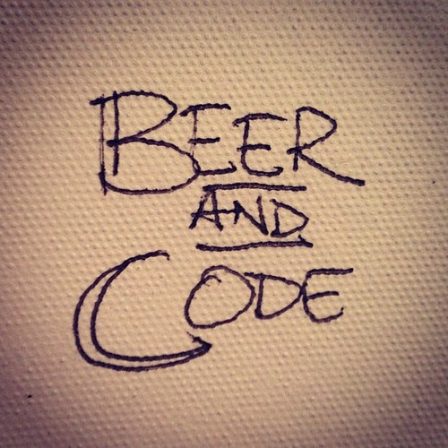

    

    <h1>Socialize, write code, and drink good beer!</h1>

    
Take your passion for programming and love of beer and
    join us for our monthly <strong>Beer and Code</strong> meetup.

The next meetup is...

    

        <!-- put post content here -->

    

